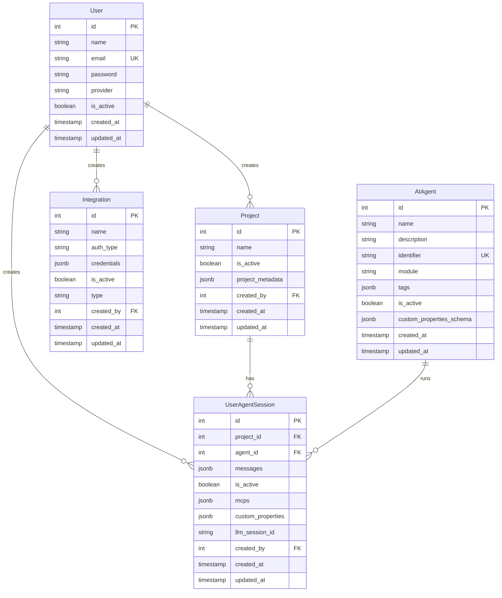

# DevOrbit AI Backend API - Complete Documentation

## Table of Contents
1. [API Overview](#api-overview)
2. [Authentication](#authentication)
3. [API Endpoints](#api-endpoints)
4. [Agent Workflows](#agent-workflows)
5. [Database Schema](#database-schema)
6. [Error Handling](#error-handling)
7. [Streaming Protocols](#streaming-protocols)
8. [MCP Integration](#mcp-integration)

---

## API Overview

### Base Information

| Property | Value |
|----------|-------|
| **Base URL** | `http://localhost:8000/api/v1` (development) |
| **Protocol** | HTTP/HTTPS |
| **Content-Type** | `application/json` |
| **Authentication** | JWT Bearer Token |
| **API Documentation** | `/docs` (Swagger UI), `/redoc` (ReDoc) |

### Health Check

```http
GET /health

Response 200:
{
  "status": "healthy",
  "version": "1.0.0",
  "service": "Claude Code Wrapper API",
  "environment": "development",
  "debug_mode": true
}
```

---

## Authentication

### Login

**Endpoint**: `POST /api/v1/auth/login`

**Request**:
```json
{
  "email": "user@example.com",
  "password": "secure_password"
}
```

**Response** (200 OK):
```json
{
  "access_token": "eyJhbGciOiJIUzI1NiIsInR5cCI6IkpXVCJ9...",
  "token_type": "bearer",
  "expires_in": 1800
}
```

**Response** (401 Unauthorized):
```json
{
  "detail": "Incorrect email or password"
}
```

### Get Current User

**Endpoint**: `GET /api/v1/auth/me`

**Headers**:
```
Authorization: Bearer {access_token}
```

**Response** (200 OK):
```json
{
  "id": 1,
  "email": "user@example.com",
  "name": "John Doe",
  "provider": "password",
  "is_active": true,
  "created_at": "2024-01-01T00:00:00Z",
  "updated_at": "2024-01-01T00:00:00Z"
}
```

### JWT Token Structure

```javascript
{
  "sub": "user@example.com",  // Subject (user identifier)
  "exp": 1234567890,           // Expiration timestamp
  "iat": 1234567890            // Issued at timestamp
}
```

**Token Expiration**:
- Access Token: 30 minutes (default)
- Refresh Token: 7 days (planned feature)

---

## API Endpoints

### 1. Projects

#### Create Project

**Endpoint**: `POST /api/v1/projects`

**Headers**:
```
Authorization: Bearer {access_token}
Content-Type: application/json
```

**Request**:
```json
{
  "name": "My SDLC Project",
  "is_active": true,
  "project_metadata": {
    "description": "Project description",
    "tags": ["backend", "api"]
  }
}
```

**Response** (201 Created):
```json
{
  "id": 1,
  "name": "My SDLC Project",
  "is_active": true,
  "project_metadata": {
    "description": "Project description",
    "tags": ["backend", "api"]
  },
  "created_by": 1,
  "created_at": "2024-01-01T00:00:00Z",
  "updated_at": "2024-01-01T00:00:00Z"
}
```

#### List Projects

**Endpoint**: `GET /api/v1/projects`

**Query Parameters**:
- `is_active` (boolean, optional): Filter by active status
- `skip` (integer, optional): Pagination offset
- `limit` (integer, optional): Pagination limit (max 100)

**Response** (200 OK):
```json
[
  {
    "id": 1,
    "name": "My SDLC Project",
    "is_active": true,
    "project_metadata": {...},
    "created_at": "2024-01-01T00:00:00Z"
  }
]
```

---

### 2. Integrations

#### List Integrations

**Endpoint**: `GET /api/v1/integrations`

**Response** (200 OK):
```json
[
  {
    "id": 1,
    "name": "GitHub Integration",
    "type": "github",
    "auth_type": "oauth2",
    "is_active": true,
    "created_at": "2024-01-01T00:00:00Z"
  },
  {
    "id": 2,
    "name": "Notion Integration",
    "type": "notion",
    "auth_type": "oauth2",
    "is_active": true,
    "created_at": "2024-01-01T00:00:00Z"
  }
]
```

#### Create Integration

**Endpoint**: `POST /api/v1/integrations`

**Request**:
```json
{
  "name": "GitHub Integration",
  "type": "github",
  "auth_type": "oauth2",
  "credentials": {
    "access_token": "ghp_xxxxxxxxxxxxxxxxxxxx",
    "refresh_token": "ghr_xxxxxxxxxxxxxxxxxxxx",
    "expires_at": "2024-12-31T23:59:59Z"
  }
}
```

**Response** (201 Created):
```json
{
  "id": 1,
  "name": "GitHub Integration",
  "type": "github",
  "auth_type": "oauth2",
  "is_active": true,
  "created_at": "2024-01-01T00:00:00Z"
}
```

#### Update Integration

**Endpoint**: `PUT /api/v1/integrations/{integration_id}`

**Request**:
```json
{
  "name": "Updated GitHub Integration",
  "is_active": false
}
```

#### Delete Integration

**Endpoint**: `DELETE /api/v1/integrations/{integration_id}`

**Response** (204 No Content)

---

### 3. Integration Clients

These endpoints provide utility functions for fetching data from integrated services.

#### GitHub

**List Repositories**:
```http
GET /api/v1/integrations/github/repos

Response 200:
[
  {
    "id": 123456789,
    "name": "my-repo",
    "full_name": "username/my-repo",
    "owner": {
      "login": "username",
      "avatar_url": "https://avatars.githubusercontent.com/u/123?v=4"
    },
    "description": "Repository description",
    "private": false,
    "html_url": "https://github.com/username/my-repo",
    "default_branch": "main",
    "language": "Python",
    "stargazers_count": 42,
    "forks_count": 10
  }
]
```

**List Branches**:
```http
GET /api/v1/integrations/github/branches?owner=username&repo=my-repo

Response 200:
[
  {
    "name": "main",
    "commit": {
      "sha": "abc123...",
      "url": "https://api.github.com/repos/..."
    },
    "protected": true
  }
]
```

**List Pull Requests**:
```http
GET /api/v1/integrations/github/pull-requests?owner=username&repo=my-repo&state=open

Response 200:
[
  {
    "number": 42,
    "title": "Add new feature",
    "state": "open",
    "user": {
      "login": "contributor",
      "avatar_url": "https://..."
    },
    "created_at": "2024-01-01T00:00:00Z",
    "updated_at": "2024-01-02T00:00:00Z",
    "html_url": "https://github.com/username/my-repo/pull/42",
    "head": {
      "ref": "feature-branch",
      "sha": "def456..."
    },
    "base": {
      "ref": "main",
      "sha": "abc123..."
    }
  }
]
```

**Validate Pull Request**:
```http
GET /api/v1/integrations/github/pull-request/validate?url=https://github.com/user/repo/pull/42

Response 200:
{
  "valid": true,
  "pr_number": 42,
  "owner": "user",
  "repo": "repo",
  "title": "Add new feature",
  "state": "open"
}
```

#### Notion

**Search Pages**:
```http
GET /api/v1/integrations/notion/pages?query=project

Response 200:
[
  {
    "id": "abc-123-def",
    "properties": {
      "title": {
        "id": "title",
        "type": "title",
        "title": [
          {
            "type": "text",
            "text": { "content": "Project Documentation" },
            "plain_text": "Project Documentation"
          }
        ]
      }
    },
    "url": "https://www.notion.so/Project-Documentation-abc123",
    "created_time": "2024-01-01T00:00:00.000Z",
    "last_edited_time": "2024-01-02T00:00:00.000Z"
  }
]
```

#### Atlassian (Jira/Confluence)

**List Confluence Spaces**:
```http
GET /api/v1/integrations/atlassian/spaces

Response 200:
[
  {
    "id": "123456",
    "key": "PROJ",
    "name": "Project Documentation",
    "type": "global",
    "status": "current",
    "_links": {
      "webui": "/spaces/PROJ"
    }
  }
]
```

**List Confluence Pages**:
```http
GET /api/v1/integrations/atlassian/pages?space_key=PROJ

Response 200:
[
  {
    "id": "789012",
    "type": "page",
    "status": "current",
    "title": "Architecture Documentation",
    "space": {
      "id": "123456",
      "key": "PROJ",
      "name": "Project Documentation"
    },
    "_links": {
      "webui": "/spaces/PROJ/pages/789012"
    }
  }
]
```

**List Jira Projects**:
```http
GET /api/v1/integrations/atlassian/projects

Response 200:
[
  {
    "id": "10001",
    "key": "PROJ",
    "name": "My Project",
    "projectTypeKey": "software",
    "style": "next-gen"
  }
]
```

**List Jira Issues**:
```http
GET /api/v1/integrations/atlassian/issues?project_key=PROJ&issue_type=Epic

Response 200:
[
  {
    "id": "10042",
    "key": "PROJ-42",
    "fields": {
      "summary": "Implement new authentication system",
      "description": "...",
      "status": {
        "name": "In Progress",
        "statusCategory": {
          "key": "indeterminate",
          "colorName": "yellow"
        }
      },
      "priority": {
        "name": "High",
        "iconUrl": "https://..."
      },
      "issuetype": {
        "name": "Epic",
        "iconUrl": "https://...",
        "subtask": false
      },
      "assignee": {
        "displayName": "John Doe",
        "emailAddress": "john@example.com",
        "avatarUrls": {...}
      },
      "created": "2024-01-01T00:00:00.000+0000",
      "updated": "2024-01-02T00:00:00.000+0000"
    }
  }
]
```

#### Observability Services

**DataDog - List Logs**:
```http
GET /api/v1/integrations/logs/datadog?from=2024-01-01&to=2024-01-31

Response 200:
[
  {
    "id": "service-1",
    "name": "api-service",
    "description": "Main API service logs",
    "last_updated": "2024-01-31T23:59:59Z",
    "dateRange": {
      "from": "2024-01-01",
      "to": "2024-01-31"
    }
  }
]
```

**PagerDuty - List Incidents**:
```http
GET /api/v1/integrations/incidents/pagerduty?service_id=P123ABC

Response 200:
[
  {
    "id": "INC-001",
    "title": "Database connection timeout",
    "type": "incident",
    "link": "https://myorg.pagerduty.com/incidents/INC-001",
    "last_seen": "2024-01-15T10:30:00Z",
    "agent_payload": {
      "severity": "high",
      "service": "database",
      "status": "triggered"
    }
  }
]
```

---

### 4. Agent Sessions

#### Create Agent Session

**Endpoint**: `POST /api/v1/agents/{agent_type}/sessions`

**Path Parameters**:
- `agent_type`: One of `code_analysis`, `code_reviewer`, `test_case_generation`, `requirements_to_tickets`, `root_cause_analysis`, `api_testing_suite`

**Request** (Code Analysis Example):
```json
{
  "project_name": "E-commerce Platform Analysis",
  "mcps": ["github", "notion"],
  "custom_properties": {
    "analysis_type": "architecture",
    "github_repos": [
      {
        "url": "https://github.com/company/backend-api",
        "branch": "main"
      },
      {
        "url": "https://github.com/company/frontend-web",
        "branch": "develop"
      }
    ],
    "docs": [
      {
        "provider": "Notion",
        "urls": [
          "https://www.notion.so/Architecture-Guide-abc123"
        ]
      }
    ],
    "custom_instructions": "Focus on scalability and security patterns",
    "ai_engine": "claude-3-5-sonnet-20241022"
  }
}
```

**Response** (201 Created):
```json
{
  "session_id": "abc-123-def-456",
  "project_id": 1,
  "agent_id": 1,
  "project_name": "E-commerce Platform Analysis",
  "mcps": ["github", "notion"],
  "custom_properties": {...},
  "created_at": "2024-01-01T00:00:00Z"
}
```

#### Run Agent

**Endpoint**: `POST /api/v1/agents/{agent_type}/run?session_id={session_id}`

**Headers**:
```
Authorization: Bearer {access_token}
Content-Type: application/json
Accept: text/event-stream
```

**Request**:
```json
{
  "message": "Start analysis"
}
```

**Response**: Server-Sent Events (SSE) stream

```
data: {"type":"text","text":"Starting code analysis..."}

data: {"type":"tool_call","toolCallId":"call_123","toolName":"read_file","args":{"file_path":"src/main.py"}}

data: {"type":"tool_result","toolCallId":"call_123","result":"File contents here..."}

data: {"type":"thinking","text":"Analyzing code structure...","signature":"analysis_phase_1"}

data: {"type":"text","text":"I've identified the following patterns:\n1. Layered architecture\n2. Repository pattern\n..."}

data: {"type":"finish","finishReason":"stop","usage":{"inputTokens":1500,"outputTokens":800}}

data: [DONE]
```

#### Continue Conversation

**Endpoint**: `POST /api/v1/agents/{agent_type}/run?session_id={session_id}`

**Request**:
```json
{
  "message": "Can you provide more details on the security patterns?"
}
```

The agent will resume the conversation using the stored `llm_session_id`, maintaining context from previous interactions.

---

### 5. File Upload

#### Upload User Files

**Endpoint**: `POST /api/v1/files/upload`

**Headers**:
```
Authorization: Bearer {access_token}
Content-Type: multipart/form-data
```

**Request** (multipart/form-data):
```
files: [File, File, ...]
```

**Response** (200 OK):
```json
{
  "uploaded_files": [
    {
      "filename": "requirements.pdf",
      "size": 1024000,
      "path": "/agents/user_1/files/requirements.pdf"
    },
    {
      "filename": "design-doc.md",
      "size": 50000,
      "path": "/agents/user_1/files/design-doc.md"
    }
  ]
}
```

#### Delete User File

**Endpoint**: `DELETE /api/v1/files/{filename}`

**Response** (204 No Content)

#### List User Files

**Endpoint**: `GET /api/v1/files`

**Response** (200 OK):
```json
[
  {
    "filename": "requirements.pdf",
    "size": 1024000,
    "uploaded_at": "2024-01-01T00:00:00Z"
  }
]
```

---

## Agent Workflows

### Workflow Lifecycle

All agent workflows follow a consistent lifecycle:

```
1. prepare()    → Setup (git clone, file copy, env initialization)
2. run()        → Main execution with Claude orchestrator
3. finalize()   → Cleanup and artifact saving
```

### 1. Code Analysis Agent

**Agent Type**: `code_analysis`

**Purpose**: Analyze code repositories to generate documentation, architecture diagrams, and knowledge graphs.

**Required Inputs**:
- `project_name` (string)
- `github_repos` (array of objects with `url` and `branch`)

**Optional Inputs**:
- `docs` (array): Supporting documentation from Notion, Confluence, Files
- `analysis_type` (string): "basic" or "deep"
- `custom_instructions` (string)
- `ai_engine` (string)

**Session Payload Example**:
```json
{
  "project_name": "Microservices Architecture",
  "mcps": ["github", "notion"],
  "custom_properties": {
    "analysis_type": "deep",
    "github_repos": [
      {
        "url": "https://github.com/company/auth-service",
        "branch": "main"
      }
    ],
    "docs": [
      {
        "provider": "Notion",
        "urls": ["https://notion.so/Auth-Design-abc123"]
      }
    ],
    "custom_instructions": "Focus on authentication flows",
    "ai_engine": "claude-3-5-sonnet-20241022"
  }
}
```

**Output**:
- Generated markdown documentation files
- Knowledge graph data (nodes and edges)
- Architecture diagrams

---

### 2. Code Reviewer Agent

**Agent Type**: `code_reviewer`

**Purpose**: Analyze pull requests for code quality, security issues, and best practices.

**Required Inputs**:
- `project_name` (string)
- `github_repos` (array with single PR object)

**Optional Inputs**:
- `docs` (array): Supporting documentation
- `analysis_type` (string): "basic" or "deep"
- `custom_instructions` (string)

**Session Payload Example**:
```json
{
  "project_name": "PR Review: Add OAuth Support",
  "mcps": ["github"],
  "custom_properties": {
    "analysis_type": "deep",
    "github_repos": [
      {
        "url": "https://github.com/company/backend/pull/42",
        "branch": "feature/oauth"
      }
    ],
    "custom_instructions": "Focus on security vulnerabilities",
    "ai_engine": "claude-3-5-sonnet-20241022"
  }
}
```

**Output**:
- Code review report with findings
- Security issues and recommendations
- Performance suggestions
- Best practice violations

---

### 3. Test Case Generation Agent

**Agent Type**: `test_case_generation`

**Purpose**: Generate comprehensive test cases from product requirement documents.

**Required Inputs**:
- `project_name` (string)
- `inputs` (array): PRD sources from Notion, Confluence, Jira, or Files

**Optional Inputs**:
- `docs` (array): Supporting documentation
- `outputs` (array): Target locations for test cases (Jira, Files)
- `descriptive_level` (string): "basic" or "deep"
- `custom_instructions` (string)

**Session Payload Example**:
```json
{
  "project_name": "E-commerce Checkout Test Suite",
  "mcps": ["notion", "atlassian"],
  "custom_properties": {
    "descriptive_level": "deep",
    "inputs": [
      {
        "type": "document",
        "provider": "Notion",
        "ids": ["abc-123", "def-456"],
        "urls": [
          "https://notion.so/Checkout-Flow-abc123",
          "https://notion.so/Payment-Integration-def456"
        ]
      }
    ],
    "outputs": [
      {
        "type": "jira",
        "project_key": "ECOM",
        "epic_key": "ECOM-100"
      }
    ],
    "custom_instructions": "Include edge cases for international payments",
    "ai_engine": "claude-3-5-sonnet-20241022"
  }
}
```

**Output**:
- Test cases grouped by type (functional, edge, negative, regression)
- Test steps with expected results
- Export to Jira tickets or files

---

### 4. Requirements to Tickets Agent

**Agent Type**: `requirements_to_tickets`

**Purpose**: Convert product requirement documents into structured Jira tickets (Epics, Stories, Subtasks).

**Required Inputs**:
- `project_name` (string)
- `inputs` (array): PRD sources

**Optional Inputs**:
- `outputs` (array): Target Jira project and epic
- `descriptive_level` (string): "basic" or "deep"
- `custom_instructions` (string)

**Session Payload Example**:
```json
{
  "project_name": "Mobile App Feature: User Profiles",
  "mcps": ["confluence", "atlassian"],
  "custom_properties": {
    "descriptive_level": "deep",
    "inputs": [
      {
        "type": "document",
        "provider": "Confluence",
        "ids": ["123456"],
        "space_key": "PROD"
      }
    ],
    "outputs": [
      {
        "type": "jira",
        "project_key": "MOB",
        "epic_key": "MOB-200"
      }
    ],
    "custom_instructions": "Break down into small, actionable stories",
    "ai_engine": "claude-3-5-sonnet-20241022"
  }
}
```

**Output**:
- Requirements table with Epic/Story/Subtask hierarchy
- Acceptance criteria
- Story points
- Priority assignments

---

### 5. Root Cause Analysis Agent

**Agent Type**: `root_cause_analysis`

**Purpose**: Analyze incidents and logs to identify root causes and recommend solutions.

**Required Inputs**:
- `project_name` (string)
- `incident` (object): Incident from Jira, PagerDuty, Sentry, New Relic, or DataDog

**Optional Inputs**:
- `github_repos` (array): Related code repositories
- `logs` (array): Logs from DataDog, Grafana, CloudWatch
- `docs` (array): Supporting documentation
- `analysis_type` (string): "basic" or "deep"
- `custom_instructions` (string)

**Session Payload Example**:
```json
{
  "project_name": "Database Timeout RCA",
  "mcps": ["github", "pagerduty", "datadog"],
  "custom_properties": {
    "analysis_type": "deep",
    "incident": {
      "provider": "pagerduty",
      "id": "INC-001",
      "url": "https://myorg.pagerduty.com/incidents/INC-001",
      "agent_payload": {
        "title": "Database connection pool exhausted",
        "severity": "high",
        "service": "api-backend"
      }
    },
    "github_repos": [
      {
        "url": "https://github.com/company/api-backend",
        "branch": "main"
      }
    ],
    "logs": [
      {
        "provider": "datadog",
        "service_id": "api-backend",
        "dateRange": "2024-01-15 09:00 to 2024-01-15 11:00"
      }
    ],
    "custom_instructions": "Focus on connection pool configuration",
    "ai_engine": "claude-3-5-sonnet-20241022"
  }
}
```

**Output**:
- Incident summary
- Timeline of events
- Possible solutions (immediate, short-term, long-term)
- Confidence scores
- Auto-fixable indicators

---

### 6. API Testing Suite Agent

**Agent Type**: `api_testing_suite`

**Purpose**: Generate automated API test suites from OpenAPI/Swagger specifications.

**Required Inputs**:
- `project_name` (string)
- `api_specs` (array): API specification files or URLs

**Optional Inputs**:
- `testcase_sources` (array): Existing test cases from Jira or Files
- `github_repos` (array): Repository to create PR with generated tests
- `framework` (string): Test framework (e.g., "playwright", "rest-assured", "postman")
- `analysis_level` (string): "basic" or "deep"
- `custom_instructions` (string)

**Session Payload Example**:
```json
{
  "project_name": "User API Test Suite",
  "mcps": ["github"],
  "custom_properties": {
    "analysis_level": "deep",
    "framework": "playwright",
    "api_specs": [
      {
        "provider": "file",
        "names": ["user-api-swagger.json"]
      }
    ],
    "testcase_sources": [
      {
        "provider": "jira",
        "keys": ["TEST-1", "TEST-2"]
      }
    ],
    "github_repos": [
      {
        "url": "https://github.com/company/api-tests",
        "branch": "main"
      }
    ],
    "custom_instructions": "Include authentication tests",
    "ai_engine": "claude-3-5-sonnet-20241022"
  }
}
```

**Output**:
- Generated test code files
- Automation report table
- Test coverage metrics
- Option to create PR with generated tests

---

## Database Schema

### Entity Relationship Diagram



### Table Definitions

#### Users Table

```sql
CREATE TABLE users (
    id SERIAL PRIMARY KEY,
    name VARCHAR(255) NOT NULL,
    email VARCHAR(255) UNIQUE NOT NULL,
    password VARCHAR(255),  -- Encrypted
    provider VARCHAR(50) NOT NULL DEFAULT 'password',
    is_active BOOLEAN NOT NULL DEFAULT TRUE,
    created_at TIMESTAMP NOT NULL DEFAULT CURRENT_TIMESTAMP,
    updated_at TIMESTAMP NOT NULL DEFAULT CURRENT_TIMESTAMP
);

CREATE INDEX idx_users_email ON users(email);
```

#### Projects Table

```sql
CREATE TABLE projects (
    id SERIAL PRIMARY KEY,
    name VARCHAR(50) NOT NULL,
    is_active BOOLEAN NOT NULL DEFAULT TRUE,
    project_metadata JSONB,
    created_by INTEGER NOT NULL REFERENCES users(id),
    updated_by INTEGER REFERENCES users(id),
    created_at TIMESTAMP NOT NULL DEFAULT CURRENT_TIMESTAMP,
    updated_at TIMESTAMP NOT NULL DEFAULT CURRENT_TIMESTAMP
);

CREATE INDEX idx_projects_created_by ON projects(created_by);
CREATE INDEX idx_projects_name_created_by ON projects(name, created_by);
CREATE INDEX idx_projects_is_active_created_by ON projects(is_active, created_by);
```

#### AI Agents Table

```sql
CREATE TABLE ai_agents (
    id SERIAL PRIMARY KEY,
    name VARCHAR(255) NOT NULL,
    description TEXT,
    identifier VARCHAR(100) UNIQUE NOT NULL,
    module VARCHAR(100) NOT NULL,
    tags JSONB,
    is_active BOOLEAN NOT NULL DEFAULT TRUE,
    custom_properties_schema JSONB,
    created_at TIMESTAMP NOT NULL DEFAULT CURRENT_TIMESTAMP,
    updated_at TIMESTAMP NOT NULL DEFAULT CURRENT_TIMESTAMP
);

CREATE UNIQUE INDEX idx_ai_agents_identifier ON ai_agents(identifier);
```

#### User Agent Sessions Table

```sql
CREATE TABLE user_agent_sessions (
    id SERIAL PRIMARY KEY,
    project_id INTEGER NOT NULL REFERENCES projects(id),
    agent_id INTEGER NOT NULL REFERENCES ai_agents(id),
    messages JSONB NOT NULL DEFAULT '[]'::jsonb,
    is_active BOOLEAN NOT NULL DEFAULT TRUE,
    mcps JSONB NOT NULL DEFAULT '[]'::jsonb,
    custom_properties JSONB NOT NULL DEFAULT '{}'::jsonb,
    llm_session_id VARCHAR(255),
    created_by INTEGER NOT NULL REFERENCES users(id),
    updated_by INTEGER REFERENCES users(id),
    created_at TIMESTAMP NOT NULL DEFAULT CURRENT_TIMESTAMP,
    updated_at TIMESTAMP NOT NULL DEFAULT CURRENT_TIMESTAMP
);

CREATE INDEX idx_sessions_created_by_project ON user_agent_sessions(created_by, project_id);
CREATE INDEX idx_sessions_created_by_agent ON user_agent_sessions(created_by, agent_id);
```

#### Integrations Table

```sql
CREATE TABLE integrations (
    id SERIAL PRIMARY KEY,
    name VARCHAR(255) NOT NULL,
    auth_type VARCHAR(50) NOT NULL,
    credentials JSONB NOT NULL,  -- Should be encrypted
    is_active BOOLEAN NOT NULL DEFAULT TRUE,
    type VARCHAR(100) NOT NULL,
    created_by INTEGER NOT NULL REFERENCES users(id),
    updated_by INTEGER REFERENCES users(id),
    created_at TIMESTAMP NOT NULL DEFAULT CURRENT_TIMESTAMP,
    updated_at TIMESTAMP NOT NULL DEFAULT CURRENT_TIMESTAMP,
    CONSTRAINT unique_integration_per_user UNIQUE (type, created_by)
);

CREATE INDEX idx_integrations_created_by ON integrations(created_by);
```

---

## Error Handling

### Standard Error Response Format

```json
{
  "detail": "Error message",
  "status_code": 400,
  "error_code": "VALIDATION_ERROR"
}
```

### HTTP Status Codes

| Code | Meaning | When to Use |
|------|---------|-------------|
| **200** | OK | Successful GET, PUT, PATCH |
| **201** | Created | Successful POST (resource created) |
| **204** | No Content | Successful DELETE |
| **400** | Bad Request | Invalid request body or parameters |
| **401** | Unauthorized | Missing or invalid authentication token |
| **403** | Forbidden | User lacks permission for resource |
| **404** | Not Found | Resource does not exist |
| **409** | Conflict | Resource already exists (e.g., duplicate integration) |
| **422** | Unprocessable Entity | Validation error (Pydantic) |
| **500** | Internal Server Error | Unexpected server error |

### Error Examples

**Validation Error (422)**:
```json
{
  "detail": [
    {
      "loc": ["body", "email"],
      "msg": "value is not a valid email address",
      "type": "value_error.email"
    }
  ]
}
```

**Authentication Error (401)**:
```json
{
  "detail": "Could not validate credentials"
}
```

**Not Found Error (404)**:
```json
{
  "detail": "Project with id 999 not found"
}
```

---

## Streaming Protocols

The API supports three streaming protocols for agent responses.

### 1. AI SDK v4 Data Stream

**Format**: Custom protocol with prefixed frames

**Example Stream**:
```
0:"Starting analysis...\n"
9:{"toolCallId":"call_123","toolName":"read_file","args":{"file_path":"src/main.py"}}\n
a:{"toolCallId":"call_123","result":"File contents..."}\n
0:"Analysis complete.\n"
d:{"finishReason":"stop","usage":{"inputTokens":1500,"outputTokens":800}}\n
```

**Frame Types**:
- `0:` - Text delta
- `2:` - Data part (JSON)
- `3:` - Error
- `8:` - Message annotation
- `9:` - Tool call
- `a:` - Tool result
- `d:` - Finish message
- `g:` - Thinking delta
- `j:` - Thinking signature

### 2. Server-Sent Events (SSE)

**Format**: Standard SSE with `data:` prefix

**Example Stream**:
```
data: {"type":"text","text":"Starting analysis..."}

data: {"type":"tool_call","toolCallId":"call_123","toolName":"read_file","args":{"file_path":"src/main.py"}}

data: {"type":"tool_result","toolCallId":"call_123","result":"File contents..."}

data: {"type":"finish","finishReason":"stop","usage":{"inputTokens":1500,"outputTokens":800}}

data: [DONE]
```

### 3. AI SDK v5 UI Message Stream

**Format**: JSON events with structured messages

**Example Stream**:
```json
{"type":"start","messageId":"ses_abc123"}
{"type":"text-start","id":"msg_1"}
{"type":"text-delta","id":"msg_1","delta":"Starting"}
{"type":"text-delta","id":"msg_1","delta":" analysis..."}
{"type":"text-end","id":"msg_1"}
{"type":"start-step"}
{"type":"tool-input-start","toolCallId":"call_123","toolName":"read_file"}
{"type":"tool-input-available","toolCallId":"call_123","input":{"file_path":"src/main.py"}}
{"type":"tool-output-available","toolCallId":"call_123","output":"File contents..."}
{"type":"finish-step"}
{"type":"finish","finishReason":"stop","usage":{"inputTokens":1500,"outputTokens":800}}
```

**Event Types**:
- `start` - Message start
- `text-start` - Text block start
- `text-delta` - Text chunk
- `text-end` - Text block end
- `start-step` - Tool invocation step start
- `tool-input-start` - Tool input start
- `tool-input-available` - Tool input complete
- `tool-output-available` - Tool output available
- `finish-step` - Tool step end
- `reasoning-start` - Thinking block start
- `reasoning-delta` - Thinking chunk
- `reasoning-end` - Thinking block end
- `finish` - Message complete

---

## MCP Integration

### MCP (Model Context Protocol) Overview

MCP provides a standardized way to integrate external tools and services with Claude Code SDK. The DevOrbit AI platform generates MCP configurations dynamically based on user integrations.

### Supported MCP Providers

1. **github** - GitHub repositories, PRs, issues
2. **atlassian** - Jira and Confluence
3. **notion** - Notion workspaces
4. **sentry** - Error tracking
5. **datadog** - Logs and metrics
6. **pagerduty** - Incident management
7. **cloudwatch** - AWS logs
8. **grafana** - Dashboards and alerts
9. **newrelic** - APM data
10. **playwright** - Browser automation (no auth required)

### MCP Configuration Generation

**Endpoint**: Internal service, not exposed via API

**Process**:
1. User creates integration with OAuth credentials
2. Session creation specifies `mcps: ["github", "notion"]`
3. Backend calls `McpService.generate_many(["github", "notion"])`
4. Service retrieves integration credentials from database
5. Jinja2 templates render MCP configs with credentials injected
6. MCP configs passed to `ClaudeOrchestrator`

**Example MCP Config (GitHub)**:
```json
{
  "github": {
    "command": "npx",
    "args": ["-y", "@modelcontextprotocol/server-github"],
    "env": {
      "GITHUB_PERSONAL_ACCESS_TOKEN": "ghp_xxxxxxxxxxxxxxxxxxxx"
    }
  }
}
```

**Example MCP Config (Notion)**:
```json
{
  "notion": {
    "command": "npx",
    "args": ["-y", "@modelcontextprotocol/server-notion"],
    "env": {
      "NOTION_API_KEY": "secret_xxxxxxxxxxxxxxxxxxxx"
    }
  }
}
```

### MCP Template System

Templates are stored in `/apps/api/app/mcp/templates/` with `.j2` extension.

**Template Variables**:
- `token` - Access token from integration
- `base_url` - Provider base URL (if applicable)
- `workspace_id` - Workspace/organization ID (if applicable)
- Provider-specific credentials

**Example Template (`github.j2`)**:
```json
{
  "command": "npx",
  "args": ["-y", "@modelcontextprotocol/server-github"],
  "env": {
    "GITHUB_PERSONAL_ACCESS_TOKEN": "{{ token }}"
  }
}
```

---

## Development Tools

### CLI Orchestrator

**Purpose**: Test Claude orchestrator directly without FastAPI

**Usage**:
```bash
# Run with message
python apps/api/app/run_orchestrator.py run -m "Analyze this repository"

# Run with stdin
echo "Analyze authentication flow" | python run_orchestrator.py run --stdin

# Run with MCP config
python run_orchestrator.py run --mcp-config mcp.json
```

### Database Migrations

**Create Migration**:
```bash
cd apps/api
alembic revision --autogenerate -m "Add new column"
```

**Apply Migrations**:
```bash
alembic upgrade head
```

**Rollback**:
```bash
alembic downgrade -1
```

### Testing

**Run All Tests**:
```bash
cd apps/api
poetry run pytest
```

**Run with Coverage**:
```bash
poetry run pytest --cov=app --cov-report=term-missing
```

---

## Best Practices

### 1. Authentication
- Always include `Authorization: Bearer {token}` header
- Refresh tokens before expiration
- Handle 401 responses by redirecting to login

### 2. Error Handling
- Check response status codes
- Parse `detail` field for error messages
- Display user-friendly errors in UI

### 3. Streaming
- Use EventSource API for SSE
- Handle reconnection on network errors
- Parse events based on protocol type

### 4. Rate Limiting
- Implement client-side throttling
- Respect retry-after headers
- Cache responses when appropriate

### 5. Security
- Never log access tokens
- Use HTTPS in production
- Validate all user inputs
- Sanitize file uploads

---

## Conclusion

The DevOrbit AI Backend API provides a comprehensive, type-safe interface for AI-powered SDLC automation. With support for multiple streaming protocols, extensive third-party integrations, and a flexible agent workflow system, it serves as a robust foundation for building intelligent development tools.

For questions or support, consult the OpenAPI documentation at `/docs` or `/redoc`.
