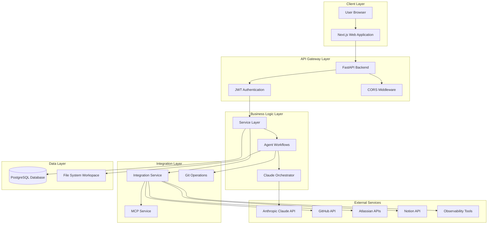
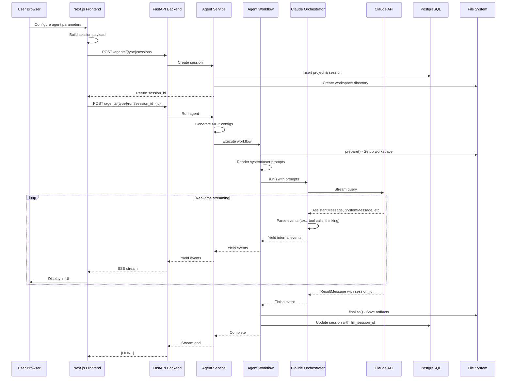
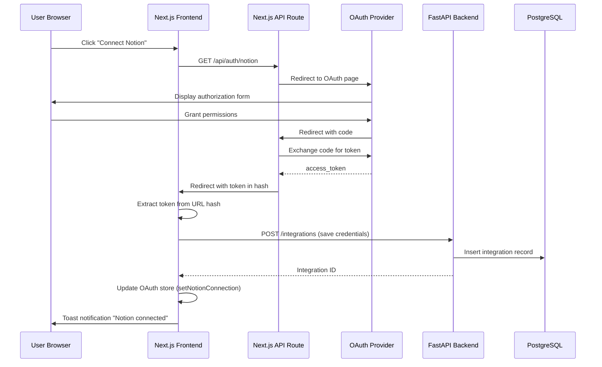

# DevOrbit AI - System Architecture Documentation

## Table of Contents
1. [Executive Summary](#executive-summary)
2. [System Overview](#system-overview)
3. [Architecture Patterns](#architecture-patterns)
4. [Technology Stack](#technology-stack)
5. [System Components](#system-components)
6. [Data Flow](#data-flow)
7. [Security Architecture](#security-architecture)
8. [Scalability Considerations](#scalability-considerations)

---

## Executive Summary

DevOrbit AI is a comprehensive AI-powered platform for automating software development lifecycle tasks. The system consists of a **FastAPI backend** that wraps the Claude Code SDK for AI agent orchestration and a **Next.js frontend** that provides a rich, type-safe user interface for interacting with various SDLC automation agents.

### Key Capabilities
- **AI-Powered Agents**: 6 specialized agents for development, QA, and product management workflows
- **Multi-Source Integration**: Connects with 11+ external services (GitHub, Jira, Notion, Sentry, DataDog, etc.)
- **Real-Time Streaming**: Server-Sent Events for live AI responses
- **Multi-Tenant**: Isolated workspaces with user-scoped data access
- **Extensible**: Plugin-based agent workflow system

---

## System Overview

### High-Level Architecture



### Component Breakdown

| Component | Technology | Responsibility |
|-----------|-----------|----------------|
| **Frontend** | Next.js 15 + React 19 + TypeScript | User interface, state management, OAuth flows |
| **Backend API** | FastAPI + Python 3.11 | API endpoints, authentication, business logic |
| **Agent System** | Claude Code SDK + Custom Workflows | AI-powered task automation |
| **Database** | PostgreSQL + SQLModel | User data, sessions, integrations |
| **Workspace** | File System | Isolated execution environments for agents |
| **Integration Layer** | MCP + OAuth Clients | Third-party service connections |
| **AI Engine** | Anthropic Claude API | Natural language processing and code generation |

---

## Architecture Patterns

### 1. Monorepo Structure

The project uses a monorepo architecture with workspace organization:

```
devorbit-ai/
├── apps/
│   ├── web/          # Next.js frontend application
│   └── api/          # FastAPI backend application
├── packages/         # Shared packages (future)
├── tools/            # Development tools
└── docs/             # Documentation
```

**Benefits**:
- Shared configuration and dependencies
- Atomic commits across frontend and backend
- Simplified CI/CD pipeline
- Consistent tooling

### 2. Layered Architecture (Backend)

The backend follows a clean layered architecture:

```
┌─────────────────────────────────────┐
│        API/Presentation Layer       │  FastAPI routes, request/response handling
├─────────────────────────────────────┤
│          Service Layer              │  Business logic, orchestration
├─────────────────────────────────────┤
│           CRUD Layer                │  Data access, query building
├─────────────────────────────────────┤
│       Database/Persistence          │  SQLModel ORM, PostgreSQL
└─────────────────────────────────────┘
```

**Separation of Concerns**:
- **API Layer**: Route definitions, validation, error handling
- **Service Layer**: Complex business logic, workflow orchestration
- **CRUD Layer**: Database operations, query construction
- **Model Layer**: Database schema definitions

### 3. Component-Based Architecture (Frontend)

The frontend uses atomic design principles:

```
Atoms (UI Primitives)
    ↓
Molecules (Reusable Components)
    ↓
Organisms (Feature Components)
    ↓
Templates (Page Layouts)
    ↓
Pages (Route Components)
```

**Component Categories**:
- **UI Components**: Shadcn/ui primitives (Button, Input, Card, etc.)
- **Shared Components**: Reusable business components (RepositorySelector, NotionPagesModal)
- **Feature Components**: Agent-specific components (RCAAgent, TestCaseViewer)
- **Layout Components**: MainLayout, Sidebar, Header
- **Page Components**: Route-specific pages

### 4. Factory Pattern (Agent Workflows)

Agent workflows use the factory pattern for extensibility:

```python
@WorkflowFactory.register(AgentIdentifier.CODE_ANALYSIS)
class CodeAnalysisWorkflow(AgentWorkflow):
    async def prepare(self, session, messages):
        # Setup logic

    async def run(self, session, messages):
        # Execution logic

    async def finalize(self, session, messages):
        # Cleanup logic
```

**Benefits**:
- Easy addition of new agent types
- Consistent lifecycle management
- Decoupled workflow registration from execution

### 5. Repository Pattern (Data Access)

CRUD operations follow the repository pattern:

```python
class BaseCRUD(Generic[ModelType, CreateSchemaType, UpdateSchemaType]):
    def __init__(self, session: AsyncSession, user_id: int):
        self.session = session
        self.user_id = user_id

    async def get_query(self) -> Select:
        # Base query with user scoping

    async def create(self, obj_in: CreateSchemaType) -> ModelType:
        # Create with audit fields
```

**Multi-Tenancy**: All queries automatically filtered by `created_by` field.

### 6. Streaming Adapter Pattern

Event streaming uses the adapter pattern for protocol flexibility:

```python
# Internal events → Protocol-specific format
events_to_ai_v4()        # AI SDK v4 data stream
events_to_sse()          # Server-Sent Events
events_to_ui_message_stream()  # AI SDK v5 UI stream
```

**Benefits**:
- Protocol-agnostic core
- Easy addition of new protocols
- Consistent event structure

---

## Technology Stack

### Backend Stack

| Category | Technology | Version | Purpose |
|----------|-----------|---------|---------|
| **Framework** | FastAPI | 0.115.12 | Web framework |
| **Runtime** | Python | 3.11+ | Programming language |
| **ASGI Server** | Uvicorn | 0.24.0 | Production server |
| **ORM** | SQLModel | 0.0.14 | Database ORM |
| **Database** | PostgreSQL | Latest | Primary database |
| **Migration** | Alembic | 1.13.1 | Schema migrations |
| **AI SDK** | Claude Code SDK | 0.0.20 | AI agent orchestration |
| **MCP** | FastMCP | 2.11.3 | Model Context Protocol |
| **Authentication** | Python-JOSE | 3.3.0 | JWT handling |
| **Password Hashing** | Passlib + Bcrypt | 1.7.4 / 4.0.1 | Secure password storage |
| **HTTP Client** | HTTPX | 0.28.1 | Async HTTP requests |
| **Logging** | Loguru | 0.7.2 | Structured logging |
| **Template Engine** | Jinja2 | 3.1.2 | Prompt/config templating |
| **Validation** | Pydantic | 2.11.7 | Data validation |
| **CLI** | Typer | 0.8.0 | Command-line interface |
| **Testing** | Pytest | 7.4.3 | Unit/integration testing |
| **Code Quality** | Black, Ruff, Mypy | Latest | Linting, formatting, type checking |

### Frontend Stack

| Category | Technology | Version | Purpose |
|----------|-----------|---------|---------|
| **Framework** | Next.js | 15.4.3 | React framework |
| **Runtime** | Node.js | 18+ | JavaScript runtime |
| **Language** | TypeScript | 5+ | Type-safe JavaScript |
| **UI Library** | React | 19.1.0 | Component library |
| **Styling** | Tailwind CSS | 4 | Utility-first CSS |
| **UI Components** | Radix UI | Various | Headless components |
| **State Management** | Zustand | 5.0.6 | Global state |
| **AI Streaming** | Vercel AI SDK | 4.3.19 | Real-time AI chat |
| **Data Tables** | TanStack Table | 8.21.3 | Table component |
| **Markdown** | React Markdown | 10.1.0 | Markdown rendering |
| **Graphs** | React Force Graph 2D | 1.28.0 | Knowledge graph visualization |
| **Notifications** | Sonner | 2.0.7 | Toast notifications |
| **Theme** | Next Themes | 0.4.6 | Dark mode support |
| **Testing** | Vitest | 3.2.4 | Unit testing |
| **Linting** | ESLint + Prettier | Latest | Code quality |

### Infrastructure

| Component | Technology | Purpose |
|-----------|-----------|---------|
| **Containerization** | Docker | Application packaging |
| **Orchestration** | Docker Compose | Multi-container management |
| **Deployment** | Fly.io | Cloud hosting (API) |
| **Build System** | Turborepo | Monorepo build orchestration |
| **Package Manager** | pnpm | Node.js dependency management |
| **Dependency Manager** | Poetry | Python dependency management |

---

## System Components

### 1. FastAPI Backend

#### Core Modules

**`app/main.py`** - Application factory
- CORS configuration
- Router registration
- Startup/shutdown events
- Health check endpoints

**`app/core/`** - Core configuration
- `config.py`: Settings management (Pydantic BaseSettings)
- `auth.py`: JWT authentication logic
- `database.py`: Database connection pooling
- `template_renderer.py`: Jinja2 template rendering

**`app/api/v1/`** - API layer
- `api.py`: Main router aggregation
- `deps.py`: Dependency injection
- `endpoints/`: Individual endpoint modules
  - `auth.py`: Authentication
  - `agents.py`: Agent execution
  - `projects.py`: Project management
  - `integrations.py`: Integration CRUD
  - `file_upload.py`: File management

**`app/agents/`** - Agent system
- `catalog.py`: Agent metadata registry
- `enums.py`: Agent types and modules
- `workflows/`: Workflow implementations
  - `base.py`: Abstract base class
  - `factory.py`: Workflow registry
  - `code_analysis.py`: Code understanding
  - `test_case_generation.py`: Test automation
  - `requirements_to_tickets.py`: Ticket generation
  - `root_cause_analysis.py`: RCA automation
  - `code_reviewer.py`: Code review
  - `api_testing_suite.py`: API test generation
- `claude/`: Claude integration
  - `orchestrator.py`: Claude Code SDK wrapper

**`app/services/`** - Service layer
- `agent_service.py`: Agent orchestration
- `mcp_service.py`: MCP configuration generation
- `integration_service.py`: OAuth and integration management
- `workspace_service.py`: File system operations
- `claude_service.py`: Direct Claude wrapper

**`app/models/`** - Database models
- `base.py`: Base model with timestamps and audit fields
- `user.py`: User authentication
- `ai_agent.py`: Agent metadata
- `project.py`: Project information
- `user_agent_session.py`: Session state
- `integration.py`: Third-party integrations

**`app/crud/`** - Data access layer
- `base.py`: Generic CRUD operations
- Specific CRUD classes for each model

**`app/mcp/`** - MCP integration
- `renderer.py`: Template-based config generation
- `templates/`: Provider-specific configs (Jinja2)

#### Request Lifecycle

```
1. Client Request
   ↓
2. CORS Middleware
   ↓
3. FastAPI Route Handler
   ↓
4. Dependency Injection (get_current_user, get_db_session)
   ↓
5. Request Validation (Pydantic schemas)
   ↓
6. Service Layer Processing
   ↓
7. CRUD Layer (Database operations)
   ↓
8. Response Serialization (Pydantic schemas)
   ↓
9. Client Response
```

### 2. Next.js Frontend

#### Core Structure

**`src/app/`** - App Router pages
- `layout.tsx`: Root layout with fonts and Toaster
- `page.tsx`: Root redirect to /login
- `(auth)/login/page.tsx`: Login page
- `(agents)/`: Protected routes
  - `layout.tsx`: MainLayout + AuthGuard
  - `dashboard/page.tsx`: Main dashboard
  - `chat/page.tsx`: Agent chat interface
  - `settings/page.tsx`: Integration settings
  - `development/`: Dev agent pages
  - `product-management/`: PM agent pages
  - `quality-assurance/`: QA agent pages
- `api/auth/`: OAuth callback routes

**`src/components/`** - Component library
- `ui/`: Shadcn/ui primitives (17 components)
- `shared/`: Reusable business components (60+ components)
- `features/`: Agent-specific components
  - `chat/`: Chat interface
  - `api-testing/`: API testing suite
  - `code-review/`: Code review
  - `product-management/`: PM components
  - `quality-assurance/`: QA components
- `layout/`: Layout components
- `auth/`: Authentication components

**`src/types/`** - TypeScript definitions (19 files)
- `api.ts`: API response types
- `auth.ts`: Authentication types
- `chat.ts`: Chat message types
- `github.ts`: GitHub integration types
- `atlassian.ts`: Jira/Confluence types
- `notion.ts`: Notion types
- `integrations.ts`: Observability types
- `test-cases.ts`: Test case types
- `agent-rca.ts`: RCA types
- `agent-api-suite.ts`: API testing types
- `knowledge-graph.ts`: Graph visualization types

**`src/store/`** - Zustand state stores
- `user.ts`: User authentication state
- `oauth.ts`: Integration connection states (11 services)
- `project.ts`: Agent session state (825 lines)

**`src/hooks/`** - Custom React hooks
- `useGitHub.ts`: GitHub API client
- `useNotion.ts`: Notion API client
- `useAtlassian.ts`: Atlassian API client
- `useOAuthTokenHandler.ts`: OAuth callback handler
- `useAgentSession.ts`: Session payload builder

**`src/lib/api/`** - API layer
- `api.ts`: Centralized API client with error handling

#### Component Rendering Flow

```
1. Route Navigation
   ↓
2. AuthGuard (check authentication)
   ↓
3. MainLayout (Sidebar + Header)
   ↓
4. Page Component
   ↓
5. Agent-Specific Components
   ↓
6. Shared/UI Components
   ↓
7. State Updates (Zustand)
   ↓
8. Re-render (React reconciliation)
```

---

## Data Flow

### 1. Agent Execution Flow



### 2. Integration Connection Flow



### 3. Data Persistence Strategy

**Backend (PostgreSQL)**:
- User accounts and authentication
- Project metadata
- Session state (messages, custom_properties, llm_session_id)
- Integration credentials (encrypted)
- AI agent metadata

**Frontend (LocalStorage)**:
- User authentication token
- Integration connection states
- Agent session configuration (pre-submission)
- Cached data (Notion pages, Jira tickets, etc.)

**File System (Agent Workspace)**:
- Cloned repositories
- Generated code/documentation
- User-uploaded files
- Agent artifacts

---

## Security Architecture

### Authentication & Authorization

**JWT-Based Authentication**:
```python
# Token generation
access_token = create_access_token(
    data={"sub": user.email},
    expires_delta=timedelta(minutes=ACCESS_TOKEN_EXPIRE_MINUTES)
)

# Token validation
payload = jwt.decode(token, SECRET_KEY, algorithms=[ALGORITHM])
```

**Authorization Flow**:
1. User submits credentials to `/auth/login`
2. Backend validates credentials and generates JWT
3. Frontend stores token in Zustand (persisted to localStorage)
4. All API requests include `Authorization: Bearer {token}` header
5. Backend validates token via `get_current_active_user()` dependency
6. User context injected into service/CRUD layers

**Multi-Tenant Isolation**:
- All database queries filtered by `created_by` field
- Workspace directories isolated per user: `{AGENTS_DIR}/{user_id}/`
- Integration credentials scoped to user

### Data Security

**Encryption at Rest**:
- User passwords: `StringEncryptedType` (SQLAlchemy-Utils)
- Integration credentials: Stored in JSONB (should add encryption)
- JWT signing: `SECRET_KEY` from environment

**Encryption in Transit**:
- HTTPS for all API communication
- Secure WebSocket connections for streaming

**CORS Policy**:
```python
allow_origins=["https://app.example.com"]  # Configured via env
allow_credentials=True
allow_methods=["GET", "POST", "PUT", "PATCH", "DELETE", "OPTIONS"]
```

### Input Validation

**Pydantic Schemas**:
```python
class CreateSessionRequest(BaseModel):
    project_name: str = Field(max_length=50)
    mcps: list[str] = []
    custom_properties: dict[str, Any] = {}
```

**Request Size Limits**:
```python
@validate_request_size(max_size=10 * 1024 * 1024)  # 10MB
async def endpoint():
    ...
```

**Prompt Sanitization**:
```python
@validate_coding_prompt(max_length=10000)
async def code_assistance(request: CodeAssistanceRequest):
    ...
```

### Secrets Management

**Environment Variables**:
- `SECRET_KEY`: JWT signing and password encryption
- `DATABASE_URL`: PostgreSQL connection string
- `ANTHROPIC_API_KEY`: Claude API access
- OAuth credentials for each provider

**Best Practices**:
- Never commit `.env` files
- Use `.env.example` for reference
- Rotate secrets regularly
- Use managed secret services in production (AWS Secrets Manager, etc.)

---

## Scalability Considerations

### Horizontal Scaling

**Stateless API Design**:
- No in-memory session storage
- All state in PostgreSQL or localStorage
- JWT tokens (no server-side session store)

**Load Balancing Ready**:
- Multiple FastAPI instances behind load balancer
- Shared database connection pool
- Consistent hashing for workspace access

### Database Optimization

**Connection Pooling**:
```python
pool_size=20
max_overflow=40
pool_timeout=30
pool_recycle=1800  # Recycle connections every 30 minutes
pool_pre_ping=True  # Health check before use
```

**Indexes**:
- Composite indexes on frequently queried columns
- Foreign key indexes for joins
- User-scoped indexes: `(created_by, project_id)`, `(created_by, is_active)`

**Query Optimization**:
- Async database operations
- Selective column loading
- Pagination for large datasets

### Caching Strategy

**Current Implementation**:
- Settings singleton (`@lru_cache`)
- Frontend caching (Zustand stores)
- Logging services cache (Project store)

**Future Enhancements**:
- Redis for session caching
- API response caching
- Computed result memoization

### Async I/O

**Backend**:
- Full async/await support
- Non-blocking database operations
- Streaming responses for low latency

**Frontend**:
- Async API calls with `fetch`
- Debounced search inputs
- Optimistic UI updates

### Workspace Isolation

**Multi-Tenant File System**:
```
{AGENTS_DIR}/
├── user_1/
│   ├── files/          # Shared user assets
│   ├── project_1/
│   │   └── session_1/  # Isolated workspace
│   └── project_2/
└── user_2/
    ├── files/
    └── project_3/
```

**Cleanup Strategy**:
- Periodic cleanup of old workspaces
- Archival of completed sessions
- User-initiated deletion

---

## Deployment Architecture

### Development Environment

```
┌─────────────────────────────────────┐
│  Developer Machine                  │
│  ┌──────────────┐  ┌──────────────┐│
│  │ Next.js Dev  │  │ FastAPI Dev  ││
│  │ Port 3000    │  │ Port 8000    ││
│  └──────────────┘  └──────────────┘│
│  ┌──────────────────────────────────┐│
│  │ PostgreSQL (Docker or Local)    ││
│  └──────────────────────────────────┘│
└─────────────────────────────────────┘
```

### Production Environment

```
┌─────────────────────────────────────────────┐
│  Cloud Infrastructure (Fly.io/Vercel)      │
│  ┌─────────────┐         ┌─────────────┐  │
│  │ Next.js App │◄────────┤ API Gateway │  │
│  │ (Vercel)    │         │ (Fly.io)   │  │
│  └─────────────┘         └─────────────┘  │
│                                             │
│  ┌─────────────────────────────────────┐  │
│  │ PostgreSQL (Managed Service)        │  │
│  └─────────────────────────────────────┘  │
│                                             │
│  ┌─────────────────────────────────────┐  │
│  │ File Storage (S3/Cloud Storage)     │  │
│  └─────────────────────────────────────┘  │
└─────────────────────────────────────────────┘
```

### CI/CD Pipeline

```
GitHub Repository
    ↓
GitHub Actions
    ├─ Lint & Type Check
    ├─ Run Tests
    ├─ Build Docker Images
    └─ Deploy
        ├─ Deploy API (Fly.io)
        └─ Deploy Web (Vercel)
```

---

## Performance Metrics

### Target Metrics

| Metric | Target | Notes |
|--------|--------|-------|
| **API Response Time** | < 200ms | Non-streaming endpoints |
| **Streaming Latency** | < 100ms | First event to client |
| **Database Query Time** | < 50ms | Simple queries |
| **Page Load Time** | < 2s | Initial page load |
| **Agent Execution Time** | Variable | Depends on task complexity |
| **Concurrent Users** | 100+ | With proper scaling |

### Monitoring

**Recommended Tools**:
- **Application Performance Monitoring (APM)**: New Relic, DataDog
- **Error Tracking**: Sentry
- **Logging**: Loguru → ELK Stack
- **Metrics**: Prometheus + Grafana
- **Uptime Monitoring**: Pingdom, UptimeRobot

---

## Conclusion

The DevOrbit AI platform demonstrates a well-architected, modern full-stack application with:

✅ **Modular Design**: Clear separation of concerns across all layers
✅ **Type Safety**: Comprehensive TypeScript and Pydantic validation
✅ **Scalability**: Async I/O, connection pooling, stateless design
✅ **Security**: JWT authentication, encryption, multi-tenant isolation
✅ **Extensibility**: Plugin-based agents, factory patterns
✅ **Developer Experience**: Strong typing, consistent patterns, comprehensive tooling

The architecture is production-ready and designed to scale horizontally while maintaining security and performance.
